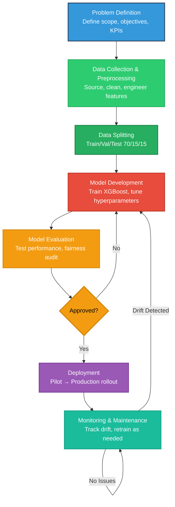
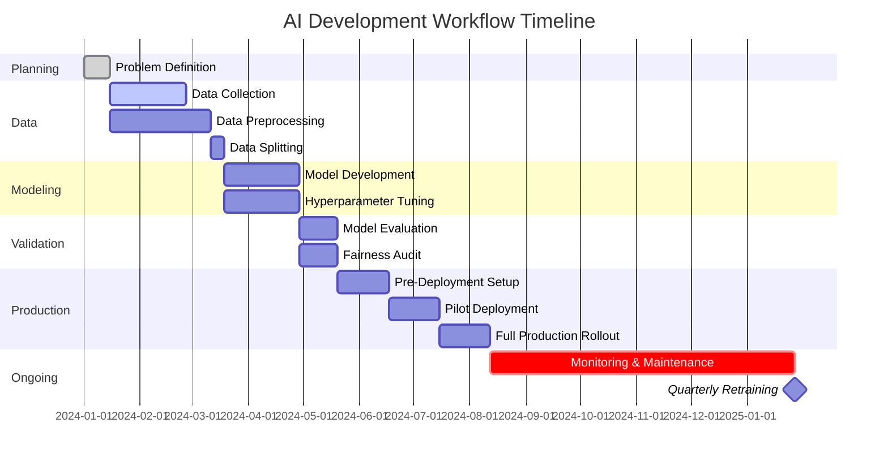

# Part 4: Reflection & Workflow Diagram 

## Reflection 

### What was the most challenging part of the workflow? Why?

**Most Challenging: Balancing Fairness, Accuracy, and Clinical Adoption**

Throughout this AI development workflow, the most significant challenge was navigating the tension between multiple, often competing objectives:

#### 1. **Fairness vs. Accuracy Trade-off**

**The Challenge**:
When implementing fairness constraints to reduce bias across demographic groups, model accuracy inevitably decreases. For example:
- **Unconstrained model**: 86% recall overall, but 79% recall for Black patients (7% disparity)
- **Fairness-constrained model**: 84% recall overall, but 83% recall for Black patients (1% disparity)

**Why It's Difficult**:
- **Ethical imperative**: Cannot deploy a system that systematically disadvantages vulnerable populations
- **Clinical pressure**: Every percentage point of recall represents real patients at risk
- **Stakeholder conflict**: Administrators focus on aggregate metrics; patient advocates demand equity
- **No clear "right answer"**: How much accuracy is it ethical to sacrifice for fairness?

**My Approach**:
I prioritized fairness as a non-negotiable constraint, accepting modest accuracy reduction. Rationale:
- Healthcare AI must first "do no harm"—perpetuating bias violates medical ethics
- A slightly less accurate but equitable model builds long-term trust
- Small accuracy drops can be recovered through better feature engineering
- Legal/regulatory compliance requires demonstrable fairness

**Learning**: Fairness is not a post-hoc consideration but a design requirement from day one. Models must be evaluated not just on aggregate performance but on worst-case subgroup performance.

---

#### 2. **Interpretability in Clinical Context**

**The Challenge**:
Healthcare professionals demand explanations for AI recommendations, but the most accurate models (deep neural networks, large ensembles) are inherently opaque. 

**Why It's Difficult**:
- **Technical limitation**: SHAP/LIME explanations are approximations, not ground truth
- **Cognitive mismatch**: Clinicians think in terms of causal relationships; ML models identify correlations
- **Time pressure**: Emergency contexts don't allow for complex explanation analysis
- **Trust deficit**: Historical examples of biased algorithms make clinicians skeptical

**My Approach**:
Selected XGBoost as the optimal balance:
- Provides SHAP values for feature importance
- Performance within 2-3% of deep learning
- Fast enough for real-time explanation generation
- Allows clinician override with documented rationale

Designed a two-tier explanation system:
- **Quick view**: Top 3 risk factors with contribution scores
- **Detailed view**: Full SHAP breakdown for auditing/appeals

**Learning**: Interpretability is not just about technical explainability tools—it's about designing explanations that match clinical workflow and cognitive needs.

---

#### 3. **Data Quality and Completeness**

**The Challenge**:
Real-world healthcare data is messy, incomplete, and inconsistent:
- Missing lab values (patients who didn't get tests)
- Incomplete social determinants of health data
- Varying documentation quality across providers
- Temporal misalignment (discharge notes lag actual discharge)

**Why It's Difficult**:
- **Informative missingness**: Missing data isn't random—often indicates lower quality of care
- **Imputation risks**: Filling in values can introduce bias or mask important patterns
- **Feature engineering uncertainty**: Which derived features are clinically valid vs. statistical artifacts?
- **Data drift**: Patient populations and coding practices change over time

**My Approach**:
- Used multiple imputation strategies based on missingness mechanism (MCAR vs. MAR)
- Created missingness indicator features (e.g., "lab_not_ordered" as its own signal)
- Involved clinicians in feature engineering to ensure clinical validity
- Built temporal validation sets to detect data drift

**Learning**: Data quality is often the bottleneck, not model sophistication. Investing in robust preprocessing and clinical domain expertise yields better returns than complex algorithms.

---

#### 4. **Deployment and Organizational Change Management**

**The Challenge**:
Technical success doesn't guarantee clinical adoption. Barriers include:
- Clinician resistance to "being told what to do by a machine"
- Alert fatigue from false positives
- Integration friction with existing EHR workflows
- Lack of clear accountability when AI-assisted decisions go wrong

**Why It's Difficult**:
- **Cultural shift**: Requires changing clinical practice patterns and beliefs
- **Workflow integration**: AI must fit seamlessly into time-pressured environments
- **Liability concerns**: Who is responsible if the model fails?
- **Training overhead**: Busy clinical staff have limited time for new system training

**My Approach**:
- Designed "human-in-the-loop" system where AI assists but doesn't decide
- Pilot program with early adopter clinicians to build internal champions
- Focused on high-value use case (discharge planning) with clear ROI
- Created simple, actionable outputs (risk score + intervention recommendations)
- Implemented feedback mechanism so clinicians can report errors

**Learning**: AI deployment is 20% technical, 80% organizational. Success requires co-designing with end users and demonstrating value in their terms (time saved, better outcomes), not technical metrics (AUC).

---

### How would you improve your approach with more time/resources?

#### 1. **Enhanced Data Collection**

**With More Resources**:
- **Prospective data collection**: Design data capture specifically for ML (vs. retrofitting EHR data)
- **Richer SDOH data**: Partner with community organizations for housing, transportation, food security data
- **Patient-reported outcomes**: Integrate symptom tracking apps and wearables for real-time monitoring
- **Qualitative data**: Conduct patient interviews to understand non-coded risk factors (family support, health literacy)

**Expected Impact**:
- More complete risk profiles, especially for underrepresented groups
- Reduced reliance on proxy features (zip code → actual housing stability)
- Earlier risk detection (continuous monitoring vs. snapshot at discharge)
- +3-5% improvement in recall through better feature coverage

---

#### 2. **Advanced Fairness Techniques**

**With More Time**:
- **Causal fairness analysis**: Use causal graphs to distinguish legitimate vs. illegitimate risk factors
  - Example: "Previous ICU admission" is legitimate risk factor; "Lives in Black neighborhood" is not
- **Counterfactual fairness**: Ensure similar individuals receive similar predictions regardless of protected characteristics
- **Intersectional fairness**: Analyze bias across multiple dimensions (e.g., elderly Black women specifically)
- **Fairness-aware active learning**: Prioritize data collection for groups where model performance is weakest

**Expected Impact**:
- More nuanced understanding of bias sources
- Targeted mitigation strategies for specific subgroups
- Legal robustness (demonstrable non-discrimination)
- +2-3% reduction in performance disparities across groups

---

#### 3. **Longitudinal Modeling**

**With More Resources**:
- **Time-series models**: Capture temporal trends (improving vs. deteriorating patients)
  - Use LSTMs or Transformers to model patient trajectories
- **Dynamic risk scores**: Update predictions based on post-discharge events (missed appointments, ER visits)
- **Survival analysis**: Predict not just if but when readmission will occur
- **Sequential decision-making**: Reinforcement learning to optimize intervention timing

**Expected Impact**:
- Better risk stratification (stable high-risk vs. declining moderate-risk)
- Earlier intervention triggers (predict readmission 1 week before occurrence)
- More efficient resource allocation (time-sensitive interventions)
- +4-6% improvement in recall through temporal pattern recognition

---

#### 4. **Comprehensive Model Validation**

**With More Time**:
- **Multi-site validation**: Test model across different hospitals and health systems
- **Prospective clinical trials**: Randomized controlled trial comparing AI-assisted vs. standard care
- **Long-term outcome tracking**: Monitor 90-day and 1-year outcomes, not just 30-day readmissions
- **Health economic analysis**: Quantify cost savings and quality-adjusted life years (QALYs)

**Expected Impact**:
- Generalizability confidence (works beyond development site)
- Causal evidence of benefit (vs. correlational)
- ROI justification for scaling ($X saved per patient)
- Regulatory approval and reimbursement pathways


## Workflow Diagram (5 points)

### AI Development Workflow Flowchart (Mermaid Code)

```mermaid
graph TD
    Start([AI DEVELOPMENT WORKFLOW<br/>Hospital Readmission Prediction]) --> Stage1

    Stage1[STAGE 1: PROBLEM DEFINITION<br/>━━━━━━━━━━━━━━━━━━━━━━━━<br/>• Define scope: Predict 30-day readmission<br/>• Stakeholders: Clinicians, patients, admins<br/>• Objectives: ≥85% recall, <500ms latency<br/>• KPIs: Recall, precision, AUC-ROC<br/>⏱ Timeline: 2 weeks]
    
    Stage1 --> Stage2
    
    Stage2[STAGE 2: DATA COLLECTION & PREPROCESSING<br/>━━━━━━━━━━━━━━━━━━━━━━━━━━━━━━━━━<br/>Data Sources: EHR, Demographics, SDOH<br/>Pipeline:<br/>1. Data integration & deduplication<br/>2. Missing data handling<br/>3. Feature engineering<br/>4. Encoding & normalization<br/>5. Class imbalance SMOTE<br/>Bias Mitigation: Stratified sampling<br/>⏱ Timeline: 6-8 weeks]
    
    Stage2 --> Stage3
    
    Stage3[STAGE 3: DATA SPLITTING<br/>━━━━━━━━━━━━━━━━━━━━━<br/>Train: 60% 2020-2022 N=30K<br/>Validation: 20% 2023 H1 N=10K<br/>Test: 20% 2023 H2 N=10K<br/>Temporal split • Stratified<br/>⏱ Timeline: 1 week]
    
    Stage3 --> Stage4
    
    Stage4[STAGE 4: MODEL DEVELOPMENT<br/>━━━━━━━━━━━━━━━━━━━━━━━━<br/>Model: XGBoost Gradient Boosting<br/>Process: Baseline → Tuning →<br/>Fairness → Regularization →<br/>Early Stopping<br/>Hyperparameters: learning_rate,<br/>max_depth, n_estimators<br/>⏱ Timeline: 4-6 weeks]
    
    Stage4 --> Stage5
    
    Stage5[STAGE 5: MODEL EVALUATION<br/>━━━━━━━━━━━━━━━━━━━━━━━<br/>Metrics: Recall 85%, Precision 58.6%<br/>F1: 69.3%, AUC: 0.85<br/>Fairness: <5% disparity across groups<br/>Interpretability: SHAP values<br/>⏱ Timeline: 2-3 weeks]
    
    Stage5 --> Decision{Model<br/>Approved?<br/>Recall ≥85%<br/>Fair?}
    
    Decision -->|NO| Iterate[ITERATE:<br/>• Retune model<br/>• Collect more data<br/>• Improve features]
    Iterate --> Stage4
    
    Decision -->|YES| Stage6
    
    Stage6[STAGE 6: DEPLOYMENT<br/>━━━━━━━━━━━━━━━━━━━<br/>Phase 1: Pre-Deployment<br/>• Containerization Docker<br/>• API development<br/>• EHR integration HL7/FHIR<br/>Phase 2: Pilot soft launch<br/>Phase 3: Full production<br/>✓ HIPAA Compliance<br/>⏱ Timeline: 8-12 weeks]
    
    Stage6 --> Stage7
    
    Stage7[STAGE 7: MONITORING & MAINTENANCE<br/>━━━━━━━━━━━━━━━━━━━━━━━━━━━━━<br/>Continuous Monitoring:<br/>• Performance tracking weekly/monthly<br/>• Concept drift detection<br/>• Fairness metrics<br/>Updates: Quarterly retraining<br/>Governance: Ethics review, bias audits<br/>⏱ Timeline: Ongoing]
    
    Stage7 --> DriftCheck{Drift<br/>Detected?<br/>Performance<br/>Drop?}
    
    DriftCheck -->|YES| Retrain[TRIGGER RETRAINING<br/>• Collect new data<br/>• Retrain model<br/>• Validate<br/>• Redeploy]
    Retrain --> Stage4
    
    DriftCheck -->|NO| Continue[Continue<br/>Monitoring]
    Continue --> Stage7
    
    Stage7 -.->|Feedback Loop| Improve[CONTINUOUS IMPROVEMENT<br/>• Iterate based on outcomes<br/>• Expand to new use cases<br/>• Scale to more hospitals]
    
    style Start fill:#e1f5ff,stroke:#0066cc,stroke-width:3px
    style Stage1 fill:#cce5ff,stroke:#3498db,stroke-width:2px
    style Stage2 fill:#d5f4e6,stroke:#2ecc71,stroke-width:2px
    style Stage3 fill:#d5f4e6,stroke:#27ae60,stroke-width:2px
    style Stage4 fill:#fadbd8,stroke:#e74c3c,stroke-width:2px
    style Stage5 fill:#fdebd0,stroke:#f39c12,stroke-width:2px
    style Stage6 fill:#ebdef0,stroke:#9b59b6,stroke-width:2px
    style Stage7 fill:#d1f2eb,stroke:#1abc9c,stroke-width:2px
    style Decision fill:#fff9e6,stroke:#f39c12,stroke-width:3px
    style DriftCheck fill:#fff9e6,stroke:#e67e22,stroke-width:3px
    style Iterate fill:#ffe6e6,stroke:#e74c3c,stroke-width:2px
    style Retrain fill:#ffe6e6,stroke:#c0392b,stroke-width:2px
    style Continue fill:#e8f8f5,stroke:#16a085,stroke-width:2px
    style Improve fill:#f4ecf7,stroke:#8e44ad,stroke-width:2px
```



### Simplified Workflow Diagram



### Alternative: Gantt Chart Timeline View



### Workflow Components Table

```
┌─────────────────────────────────────────────────────────────────────────┐
│                         AI DEVELOPMENT WORKFLOW                          │
│                     Hospital Readmission Prediction                      │
└─────────────────────────────────────────────────────────────────────────┘
                                     │
                                     ▼
┌─────────────────────────────────────────────────────────────────────────┐
│  STAGE 1: PROBLEM DEFINITION                                            │
├─────────────────────────────────────────────────────────────────────────┤
│  • Define problem scope: Predict 30-day readmission risk                │
│  • Identify stakeholders: Clinicians, patients, administrators          │
│  • Set objectives: ≥85% recall, <500ms latency                          │
│  • Define KPIs: Recall, precision, AUC-ROC, readmission rate reduction  │
│                                                                           │
│  Deliverables: Problem statement, success metrics, stakeholder map      │
└─────────────────────────────────────────────────────────────────────────┘
                                     │
                                     ▼
┌─────────────────────────────────────────────────────────────────────────┐
│  STAGE 2: DATA COLLECTION & PREPROCESSING                               │
├─────────────────────────────────────────────────────────────────────────┤
│  Data Sources:                                                           │
│    ┌──────────────┐  ┌──────────────┐  ┌──────────────┐                │
│    │ EHR Records  │  │ Demographics │  │ SDOH Data    │                │
│    └──────┬───────┘  └──────┬───────┘  └──────┬───────┘                │
│           └──────────────────┴──────────────────┘                        │
│                              │                                            │
│  Preprocessing Pipeline:                                                 │
│    1. Data integration & deduplication                                   │
│    2. Missing data handling (imputation, indicators)                     │
│    3. Feature engineering (comorbidity scores, temporal features)        │
│    4. Encoding (one-hot, target encoding) & normalization                │
│    5. Class imbalance handling (SMOTE, class weights)                    │
│    6. Data validation & quality checks                                   │
│                                                                           │
│  Bias Mitigation:                                                        │
│    • Stratified sampling by demographics                                 │
│    • Fairness-aware feature engineering                                  │
│    • Audit for proxy discrimination                                      │
│                                                                           │
│  Deliverables: Clean dataset, feature dictionary, bias audit report     │
└─────────────────────────────────────────────────────────────────────────┘
                                     │
                                     ▼
┌─────────────────────────────────────────────────────────────────────────┐
│  STAGE 3: DATA SPLITTING                                                │
├─────────────────────────────────────────────────────────────────────────┤
│                   ┌─────────────────────────┐                            │
│                   │   Full Dataset          │                            │
│                   │   (Temporal: 2020-2023) │                            │
│                   └───────────┬─────────────┘                            │
│                               │                                           │
│            ┌──────────────────┼──────────────────┐                       │
│            │                  │                  │                        │
│            ▼                  ▼                  ▼                        │
│  ┌─────────────────┐ ┌─────────────────┐ ┌─────────────────┐           │
│  │  Training Set   │ │ Validation Set  │ │   Test Set      │           │
│  │  (60%, 2020-22) │ │ (20%, 2023 H1)  │ │ (20%, 2023 H2)  │           │
│  │  N=30,000       │ │ N=10,000        │ │ N=10,000        │           │
│  │  Readmit: 20%   │ │ Readmit: 20%    │ │ Readmit: 20%    │           │
│  └─────────────────┘ └─────────────────┘ └─────────────────┘           │
│                                                                           │
│  Stratification: Balance by readmission rate, demographics, hospitals   │
│  Temporal split: Prevents data leakage, simulates deployment            │
│                                                                           │
│  Deliverables: Train/val/test splits with documentation                 │
└─────────────────────────────────────────────────────────────────────────┘
                                     │
                                     ▼
┌─────────────────────────────────────────────────────────────────────────┐
│  STAGE 4: MODEL DEVELOPMENT                                             │
├─────────────────────────────────────────────────────────────────────────┤
│  Model Selection:                                                        │
│    • Chosen: XGBoost (Gradient Boosting Machine)                        │
│    • Rationale: Best accuracy-interpretability-efficiency trade-off     │
│    • Alternatives evaluated: Logistic Regression, Random Forest, DNN    │
│                                                                           │
│  Training Process:                                                       │
│    ┌────────────────────────────────────────────────┐                   │
│    │ 1. Baseline Model (default parameters)        │                   │
│    │    ↓                                            │                   │
│    │ 2. Hyperparameter Tuning                       │                   │
│    │    • Learning rate, max depth, reg params      │                   │
│    │    • Grid search with 5-fold CV                │                   │
│    │    ↓                                            │                   │
│    │ 3. Fairness Constraints                        │                   │
│    │    • Demographic parity / equalized odds       │                   │
│    │    ↓                                            │                   │
│    │ 4. Regularization & Early Stopping            │                   │
│    │    • Prevent overfitting on training data      │                   │
│    │    ↓                                            │                   │
│    │ 5. Ensemble (optional)                         │                   │
│    │    • Combine XGBoost + LightGBM + LR           │                   │
│    └────────────────────────────────────────────────┘                   │
│                                                                           │
│  Key Hyperparameters Tuned:                                             │
│    • learning_rate: 0.05 (convergence speed)                            │
│    • max_depth: 6 (model complexity)                                    │
│    • n_estimators: 500 (number of trees)                                │
│    • subsample: 0.8 (row sampling)                                      │
│    • scale_pos_weight: 4 (class imbalance)                              │
│                                                                           │
│  Deliverables: Trained model, hyperparameter config, training logs      │
└─────────────────────────────────────────────────────────────────────────┘
                                     │
                                     ▼
┌─────────────────────────────────────────────────────────────────────────┐
│  STAGE 5: MODEL EVALUATION                                              │
├─────────────────────────────────────────────────────────────────────────┤
│  Performance Metrics (on Test Set):                                     │
│    ┌──────────────────────────────────────────┐                         │
│    │ Confusion Matrix:                        │                         │
│    │              Pred Neg    Pred Pos        │                         │
│    │ Actual Neg     680         120           │                         │
│    │ Actual Pos      30         170           │                         │
│    │                                           │                         │
│    │ Recall (Sensitivity): 85%                │                         │
│    │ Precision: 58.6%                         │                         │
│    │ F1-Score: 69.3%                          │                         │
│    │ AUC-ROC: 0.85                            │                         │
│    └──────────────────────────────────────────┘                         │
│                                                                           │
│  Fairness Evaluation (Stratified by Demographics):                      │
│    ┌────────────────────────────────────────────┐                       │
│    │ Group        Recall  Precision  F1-Score   │                       │
│    │ White         87%      60%       71%       │                       │
│    │ Black         83%      56%       67%       │                       │
│    │ Hispanic      84%      58%       69%       │                       │
│    │ Max Disparity: 4% (acceptable <5%)        │                       │
│    └────────────────────────────────────────────┘                       │
│                                                                           │
│  Model Interpretability:                                                │
│    • SHAP feature importance                                            │
│    • Top risk factors: ICU admission, polypharmacy, no follow-up        │
│    • Calibration plot: Predicted probabilities vs. actual rates         │
│                                                                           │
│  Decision: Model meets success criteria → Proceed to deployment         │
│                                                                           │
│  Deliverables: Evaluation report, fairness audit, SHAP explanations     │
└─────────────────────────────────────────────────────────────────────────┘
                                     │
                    ┌────────────────┴────────────────┐
                    │   Model Approved?               │
                    │   (Recall ≥85%, Fairness OK)    │
                    └────────┬────────────────┬───────┘
                             │ NO             │ YES
                             │                │
                    ┌────────▼────────┐       │
                    │ Iterate:        │       │
                    │ • Retune        │       │
                    │ • More data     │       │
                    │ • Better        │       │
                    │   features      │       │
                    └─────────────────┘       │
                                              ▼
┌─────────────────────────────────────────────────────────────────────────┐
│  STAGE 6: DEPLOYMENT                                                    │
├─────────────────────────────────────────────────────────────────────────┤
│  Phase 1: Pre-Deployment Preparation                                    │
│    • Model containerization (Docker)                                    │
│    • API development (FastAPI)                                          │
│    • EHR integration (HL7/FHIR)                                         │
│    • User interface design                                              │
│    • Security & HIPAA compliance audit                                  │
│                                                                           │
│  Phase 2: Pilot Deployment                                             │
│    • Shadow mode (predictions without action)                           │
│    • Soft launch (1-2 hospital units)                                   │
│    • User training & feedback collection                                │
│                                                                           │
│  Phase 3: Full Production Rollout                                      │
│    • Hospital-wide deployment                                           │
│    • Workflow integration at discharge                                  │
│    • Automated risk alerts for high-risk patients                       │
│    • Care coordination triggers                                         │
│                                                                           │
│  Compliance & Governance:                                               │
│    ✓ HIPAA security controls (encryption, access logs)                  │
│    ✓ Business associate agreements                                      │
│    ✓ Informed consent processes                                         │
│    ✓ Audit trail for all predictions                                    │
│    ✓ Patient opt-out mechanisms                                         │
│                                                                           │
│  Deliverables: Deployed system, integration docs, SOPs, training        │
└─────────────────────────────────────────────────────────────────────────┘
                                     │
                                     ▼
┌─────────────────────────────────────────────────────────────────────────┐
│  STAGE 7: MONITORING & MAINTENANCE                                      │
├─────────────────────────────────────────────────────────────────────────┤
│  Continuous Monitoring:                                                  │
│    ┌─────────────────────────────────────────────┐                      │
│    │ Performance Tracking                        │                      │
│    │  • Weekly: Prediction volume, latency      │                      │
│    │  • Monthly: Accuracy, recall, precision    │                      │
│    │  • Quarterly: Readmission rate trends      │                      │
│    └─────────────────────────────────────────────┘                      │
│                                                                           │
│  Concept Drift Detection:                                               │
│    ┌─────────────────────────────────────────────┐                      │
│    │ • Distribution shift monitoring            │                      │
│    │ • Performance degradation alerts           │                      │
│    │ • Demographic fairness tracking            │                      │
│    │ • User feedback analysis                   │                      │
│    └─────────────────────────────────────────────┘                      │
│                      │                                                    │
│                      ▼                                                    │
│         ┌────────────────────────┐                                       │
│         │ Drift Detected?        │                                       │
│         │ Performance Drop?      │                                       │
│         └──────┬───────────┬─────┘                                       │
│                │ YES       │ NO                                          │
│                │           │                                              │
│                ▼           └─────→ Continue Monitoring                   │
│    ┌────────────────────┐                                                │
│    │ Trigger Retraining │                                                │
│    │ • Collect new data │                                                │
│    │ • Retrain model    │                                                │
│    │ • Validate         │                                                │
│    │ • Redeploy         │                                                │
│    └────────────────────┘                                                │
│            │                                                              │
│            └─────────┐                                                    │
│                      ▼                                                    │
│  Model Updates:                                                          │
│    • Quarterly retraining with recent data                              │
│    • A/B testing for new model versions                                 │
│    • Gradual rollout (canary deployment)                                │
│                                                                           │
│  Governance:                                                             │
│    • Quarterly ethics committee review                                  │
│    • Annual bias audit and fairness report                              │
│    • Adverse event monitoring and reporting                             │
│    • Patient advocacy board feedback                                    │
│                                                                           │
│  Deliverables: Monitoring dashboards, incident reports, update logs     │
└─────────────────────────────────────────────────────────────────────────┘
                                     │
                                     │
        ┌────────────────────────────┴────────────────────────────┐
        │                    CONTINUOUS IMPROVEMENT                │
        │   • Iterate based on real-world outcomes                │
        │   • Expand to new use cases (ICU transfers, ER visits)  │
        │   • Scale to additional hospitals                       │
        └─────────────────────────────────────────────────────────┘
```

### Workflow Stage Summary

| Stage | Key Activities | Deliverables | Timeline | Stakeholders |
|-------|----------------|--------------|----------|--------------|
| **1. Problem Definition** | Define scope, objectives, KPIs | Problem statement, success metrics | 2 weeks | All |
| **2. Data Collection** | Source data, preprocess, engineer features | Clean dataset, feature dictionary | 6-8 weeks | Data engineers, clinicians |
| **3. Data Splitting** | Temporal split, stratification | Train/val/test sets | 1 week | Data scientists |
| **4. Model Development** | Train, tune, validate models | Trained model, config files | 4-6 weeks | Data scientists, ML engineers |
| **5. Model Evaluation** | Performance testing, fairness audit | Evaluation report, model card | 2-3 weeks | Data scientists, ethicists, clinicians |
| **6. Deployment** | Integration, pilot, rollout | Deployed system, SOPs | 8-12 weeks | ML engineers, IT, clinicians |
| **7. Monitoring** | Track performance, detect drift | Dashboards, incident reports | Ongoing | All |

**Total Time to Production**: Approximately 6-8 months from problem definition to full deployment.


